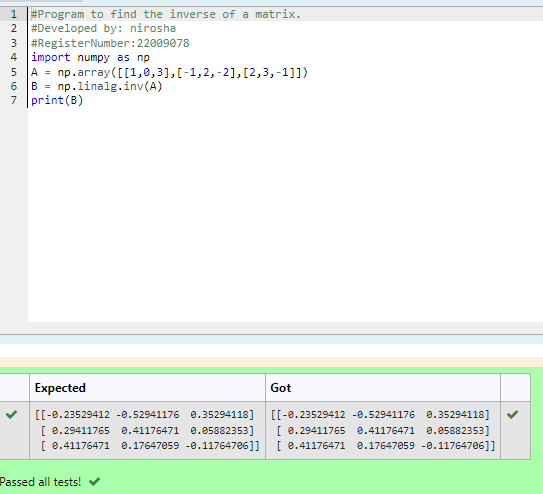

# INVERSE-OF-A-MATRIX
## Aim:
To write a python program to find the inverse of a matrix
## Equipment’s required:
1. 	Hardware – PCs
2. 	Anaconda – Python 3.7 Installation / Moodle-Code Runner
## Algorithm:

### Step1 : 
Import numpy package
### Step 2:
Get the input matrix
### Step 3: 
Find the inverse of the matrix
### Step 4: 
Print the result
## Program:
```maths
#Program to find the inverse of a matrix.
#Developed by: nirosha
#RegisterNumber:22009078
import numpy as np
A = np.array([[1,0,3],[-1,2,-2],[2,3,-1]])
B = np.linalg.inv(A)
print(B)
```
## Output:


## Result:
Thus the inverse of given matrix is successfully solved using python program

